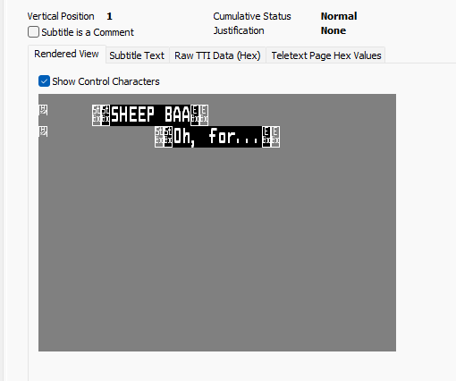
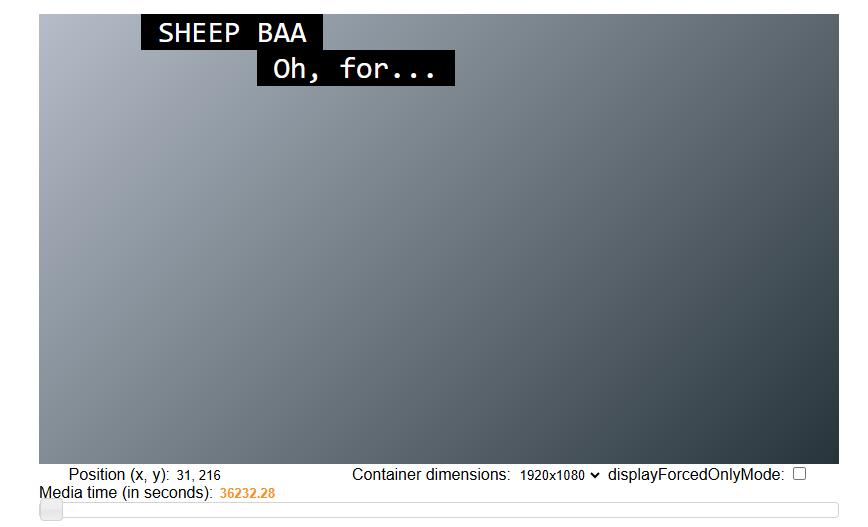

# EBU STL Subtitle File to TTML convertor

## What is this?
This is some code to convert EBU STL subtitle files used primarily in Broadcast into [TTML](https://en.wikipedia.org/wiki/Timed_Text_Markup_Language) XML files used also within Broadcast but also in OTT. 

EBU STL files are used to store the raw subtitle lines ("Cues") with a timecode of when to show them. They are generally "played out" alongside the video playback and are generally formatted for presentation on Teletext subtitle systems. This means that the authoring of the EBU STLs files will assume a display area and attributes, such as line and column limits, that the font is monospaced and that subtitles are actually shown using 2 Teletext lines ("Double Height").

## Why?
I was working on a project which required conversion of EBU STL files to TTML for OTT but we were experiencing some complications with the commercial software that we were using. We are still using the commercial software but this project helped me understand the standards better and learn what to look for. The journey being more important than arriving! As I spent (personal not work) time on the project I thought I would share my awful code for others.

I had a lot of help from our Accessibility department which I very much appreciate.

## References
The EBU STL format is documented in [EBU Tech 3264-1991](https://tech.ebu.ch/docs/tech/tech3264.pdf)

The EBU also released a very useful document on suggested approaches to converting EBU STLs to EBU Timed Text in STL [Mapping to EBU-TT (EBU Tech 3360)](https://tech.ebu.ch/docs/tech/tech3360.pdf)

Whilst this code is not outputting EBU Timed Text, it aims to output the [IMSC1](https://www.w3.org/TR/ttml-imsc1.0.1/) standard which, although a superset of EBU-TT, this code should maintain compatibility. [EBU comparison of EBU-TT and IMSC1](https://tech.ebu.ch/docs/events/IBC2015/EBU-TT-D_and_IMSC.pdf)

Within the code, I copied heavily from [Quentin Renard's go-astisub project](https://github.com/asticode/go-astisub) for the TTML code and for ideas. I am sure that that project, and others, would provide the functionality I needed, but the purpose of this project was to learn, not to use!

I hope I have credited all code and standards source but apologies for any I missed. Additionally, I captured a number of public DASH video streams and decoded the subtitles to analyse alternative ways of formatting.

## Example STL file
Our Access Services team kindly provided the example [mp4](examples/subs_test_with_audio_v1.mp4) and matching [STL file](examples/subs_test_with_audio_v1.stl) for testing purposes. Many thanks to Matt for this.


## Challenges
The greatest challenge I found was maintaining positioning. STLs offer 3 horizontal positions - left justified, centre justified and right justified - but it also offers unjustified ("unchanged presentation"). This latter mode is often used with space padding between lines to provide more complex positioning. The only method I have found to support this, without breaking up the individual subtitle "cues" into lots of regions, is to use the `xml:space="preserve"` attribute but I am not convinced of how widely this is supported between players.

For example, with the following Cue,



I've rendered this using preserved space to look like this (in the excellent [IMSC1 Renderer](https://www.sandflow.com/imsc1_1/) )



using the XML block

```
<p begin="10:03:52.280" end="10:03:54.760" region="region.1.2.1.25" tts:fontSize="200%" tts:lineHeight="120%" tts:textAlign="left"><span tts:backgroundColor="transparent" tts:color="transparent" xml:space="preserve">     </span><span tts:backgroundColor="#000000" tts:color="#FFFFFF" xml:space="preserve"> SHEEP BAA </span> <br /><span tts:backgroundColor="transparent" tts:color="transparent" xml:space="preserve">            </span><span tts:backgroundColor="#000000" tts:color="#FFFFFF" xml:space="preserve"> Oh, for... </span> </p>
```

Additionally, I really struggled with how to parse the control characters, the EBU STL format uses a collection of control characters to format the Cues (e.g. to change the colour) but also to provide accented characters. This, coupled with the "Double Height" of teletext subtitles did mean I used some assumptions, which I hope are valid.

## Code
There are 2 packages;

* ebustl - a very basic STL reader, it does not manipulate the subtitles, rather just reads the file to structures processing later.
* ttmlgenerate - this is where the interpretation of the Cues is performed and where all the styling is applied.

A very basic command line app is included in ./cmd/stl-to-ttlml

## CLI usage
### Compile

    cd ./cmd/stl-to-ttml/
    go build ./stl-to-ttml.go

### Modes of operation
The CLI supports 4 modes of operation
* [single file conversion](#single)
* [folder conversion with polling](#folder)
* [splitting a subtitle file to multiple TTML files. e.g. 1 for each part of a programme](#split)
* [conforming a subtitle file to remove breaks, add breaks and also add padding](#conform)

#### <a name="single"></a>Single File
convert a single suppied file to TTML e.g. (when compiled)

    stl-to-ttml subs_test_with_audio_v1.stl subs_test_with_audio_v1.ttml


#### <a name="folder"></a>Folder once or continuously
To process a single folder once, you can use the "folder" mode and provide the source and destination folders;

    stl-to-ttml -mode=folder ./scan-in ./scan-out

If you wish to leave the process running and scan every "x" number of seconds, you can add an interval parameter and also a folder to move processed files to e.g.

    stl-to-ttml -mode=folder -interval=10 ./scan-in ./scan-out ./processed

Note that for folder scans, only files with a `.stl` extension will be picked up. I haven't put much error handling and so the continuous scan may not be reliable if it hits an issue with a file.


#### <a name="split"></a>Splitting a file
To split a file, you need to supply a JSON edit list file which lists all the parts and the timecodes in and out of those files. Each part will create a new TTML file, with the subtitles offset from 00:00:00:00. E.G. if you had a part with the incode 10:20:00:00, a subtitle file at 10:21:22:23 will be offset to 00:01:22:23

Example JSON file
```
{
	"InputFilePath": "E:\\projects\\golang\\ebustl-to-ttml\\testfiles\\0t0bmh6_ENG.stl",
	"Parts": [
        {
            "TimecodeStart": "10:00:00:00",
            "TimecodeEnd": "10:16:58:11",
            "OutputFilePath": "E:\\projects\\golang\\ebustl-to-ttml\\testfiles\\output\\0t0bmh6_ENG_PART1.ttml"
        },
        {
            "TimecodeStart": "10:18:00:00",
            "TimecodeEnd": "10:29:02:00",
            "OutputFilePath": "E:\\projects\\golang\\ebustl-to-ttml\\testfiles\\output\\0t0bmh6_ENG_PART2.ttml"
        },
        {
            "TimecodeStart": "10:30:00:00",
            "TimecodeEnd": "10:44:32:22",
            "OutputFilePath": "E:\\projects\\golang\\ebustl-to-ttml\\testfiles\\output\\0t0bmh6_ENG_PART3.ttml"
        },
        {
            "TimecodeStart": "10:45:00:00",
            "TimecodeEnd": "10:58:33:04",
            "OutputFilePath": "E:\\projects\\golang\\ebustl-to-ttml\\testfiles\\output\\0t0bmh6_ENG_PART4.ttml"
        },
        {
            "TimecodeStart": "10:59:00:00",
            "TimecodeEnd": "11:12:28:14",
            "OutputFilePath": "E:\\projects\\golang\\ebustl-to-ttml\\testfiles\\output\\0t0bmh6_ENG_PART5.ttml"
        },
        {
            "TimecodeStart": "11:13:00:00",
            "TimecodeEnd": "11:23:17:24",
            "OutputFilePath": "E:\\projects\\golang\\ebustl-to-ttml\\testfiles\\output\\0t0bmh6_ENG_PART6.ttml"
        },
        {
            "TimecodeStart": "11:24:00:00",
            "TimecodeEnd": "11:34:05:10",
            "OutputFilePath": "E:\\projects\\golang\\ebustl-to-ttml\\testfiles\\output\\0t0bmh6_ENG_PART7.ttml"
        }
    ]
}
```

Running the split job

    stl-to-ttml -mode=split E:\projects\golang\ebustl-to-ttml\testfiles\split_job.json

#### <a name="conform"></a>Conforming a file
You can "conform" a file by editing out gaps and also inserting "padding" to account for the addition of bumpers etc. As with splitting, you supply a JSON job file which details the parts of the subtitle to use and also addition of any padding, for example;

```
{
	"InputFilePath": "E:\\projects\\golang\\ebustl-to-ttml\\testfiles\\0t0bmh6_ENG.stl",
    "OutputFilePath": "E:\\projects\\golang\\ebustl-to-ttml\\testfiles\\output\\0t0bmh6_ENG_conformed.ttml",
	"Sources": [
        {
            "TimecodeStart": "00:00:00:00",
            "TimecodeEnd": "00:10:00:00",
            "Padding": true
        },
        {
            "TimecodeStart": "10:00:00:00",
            "TimecodeEnd": "10:16:58:11",
            "Padding": false
        },
        {
            "TimecodeStart": "10:18:00:00",
            "TimecodeEnd": "10:29:02:00",
            "Padding": false
        },
        {
            "TimecodeStart": "10:30:00:00",
            "TimecodeEnd": "10:44:32:22",
            "Padding": false
        },
        {
            "TimecodeStart": "10:45:00:00",
            "TimecodeEnd": "10:58:33:04",
            "Padding": false
        },
        {
            "TimecodeStart": "10:59:00:00",
            "TimecodeEnd": "11:12:28:14",
            "Padding": false
        },
        {
            "TimecodeStart": "11:13:00:00",
            "TimecodeEnd": "11:23:17:24",
            "Padding": false
        },
        {
            "TimecodeStart": "11:24:00:00",
            "TimecodeEnd": "11:34:05:10",
            "Padding": false
        }
    ]
}
```

In the above example, the first part, namely

```
        {
            "TimecodeStart": "00:00:00:00",
            "TimecodeEnd": "00:10:00:00",
            "Padding": true
        },
```
will add a 10 minute padding at the start of the output file, this is signalled by the "Padding" being set to true. If "Padding" is set to false, then source subtitles between the timecodes of the part are copied to the output, again, the source subtitles are offset to ensure a continuous timecode.

Similar to the split mode, you run a conform job by pointing the CLI at the JSON job file

    stl-to-ttml -mode=conform E:\projects\golang\ebustl-to-ttml\testfiles\conform_job.json

## Limitations
* Control codes 0x08 (Flash) and 0x09 (Steady (1,2)) are not supported, a warning will be written to STDOUT but processing will continue - EBU recommendation "This code is technically valid in an STL TTI block, but would not be expected to be used.", although I did find it in a production sample file.


## Issues
* only supports 25 fps
* ~~Accented chars~~
* ~~leading and trailing empty box missing~~
* make settings more configurable
* support alternative display approaches.
* create other variants of TTML.
* only a couple of code pages supported in Cues (and only 850 for the header "GSI" section)
* ~~review how the Cues are processed, it's very messy right now,~~ I've rewritten to write to a virtual screen and interpret that, will see if better
* ~~add folder mode + watch~~
* ~~add editor mode for stitch and also split~~
* support S3 source / destination

## Versions
* 1.0.1 - initial attempt
* 1.1.0 - new render approach;
	* rewrite of render process to separate the Teletext decode from the TTML encode due to formatting issues observed. 
	* increased dubugging output

## Credits
* as well are copying and editing [Quentin Renard's go-astisub project](https://github.com/asticode/go-astisub)
* I used [Benoît Amiaux's iobit package](https://github.com/bamiaux/iobit) to parse the EBU STL file

## Improvements, Errors
As always, please feel free to amend, update, correct!
